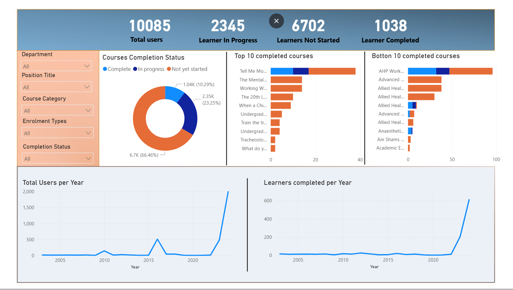

# NHS-Learning-Academy-Training-Performance-Dashboard
A lightweight Power BI solution that gives GOSH Learning Academy leaders a single view of who is trained, what is overdue, and where to focus next. It uses fully synthetic, non-PII data to demonstrate the end-to-end approach: data modelling, DAX measures, visuals, and operationalisation (refresh, distribution, and governance).

**Why this exists**
Leaders need fast, trustworthy answers to questions like:
How many learners have completed, are in progress, or not started?
Which mandatory courses and onboarding items risk non-compliance?
Which departments, bands, and managers need targeted support?
Which courses have the highest/lowest completion and engagement?

**What you’ll see (features)**
At-a-glance tiles: Total users, In Progress, Not Started, Completed
Completion donut: Complete / In progress / Not started
Top/Bottom courses by completion (quick wins + problem areas)
Trends: Users per year, completions per year
Slicers: Department, Position Title, Course Category, Enrolment Type, Completion Status
Drill-downs to department and manager level (optional RLS pattern)

**Tech stack**
Power BI Desktop (reporting, DAX, visuals)
Power Query (data cleaning and shaping)
CSV (synthetic datasets)
Optional: Power Automate for weekly KPI digests to Teams/Email

**Synthetic datasets (non-PII)**

data/gla_staff_simple.csv – 5,000+ synthetic staff rows
#staff_id, first_name, last_name, email (fake), department, position_title, band, start_date, manager_name, onboarding_required, onboarding_completed
data/gla_training_simple.csv – 20,000+ training events

event_id, staff_id, course_code, course_name, category (Onboarding/Mandatory/Development), mandatory (1/0), format, status (Completed/In Progress/Not Started/No Show), attendance_date, completion_date, hours_spent 
<b> Last </b>

⚠️ All data is fabricated for demonstration and contains no real personal information.

Data model (star)

Fact: gla_training_simple

Dimensions: gla_staff_simple, dim_course (optional), dim_date (optional)

Relationships: gla_staff_simple[staff_id] → gla_training_simple[staff_id]

Core DAX measures that i made use of>>

<tt>-- Core volumes
Headcount = DISTINCTCOUNT(gla_staff_simple[staff_id])

Learners Completed =
CALCULATE(COUNTROWS(gla_training_simple), gla_training_simple[status] = "Completed")

Learners In Progress =
CALCULATE(COUNTROWS(gla_training_simple), gla_training_simple[status] = "In Progress")

Learners Not Started =
CALCULATE(COUNTROWS(gla_training_simple), gla_training_simple[status] = "Not Started")

Total Training Hours = SUM(gla_training_simple[hours_spent])

-- Completion split
Completion % =
DIVIDE([Learners Completed],
       [Learners Completed] + [Learners In Progress] + [Learners Not Started])

-- Mandatory compliance (person-level)
Mandatory Compliance % =
AVERAGE(gla_staff_simple[mandatory_compliant])   -- assumes 1/0 on staff record

-- Onboarding (requirement-aware)
Onboarding Required =
CALCULATE(COUNTROWS(gla_staff_simple), gla_staff_simple[onboarding_required] = 1)

Onboarding Completed (req only) =
CALCULATE(COUNTROWS(gla_staff_simple),
    gla_staff_simple[onboarding_required] = 1 &&
    gla_staff_simple[onboarding_completed] = 1
)

Onboarding Completion % =
DIVIDE([Onboarding Completed (req only)], [Onboarding Required])

-- Course popularity
Top Course Completions =
CALCULATE([Learners Completed], VALUES(gla_training_simple[course_name]))

-- Risk indicators
No Show % =
VAR totalEnrol = COUNTROWS(gla_training_simple)
RETURN
DIVIDE(
  CALCULATE(COUNTROWS(gla_training_simple), gla_training_simple[status] = "No Show"),
  totalEnrol
)<tt>
## 🚀 Use Cases

- Track staff progress
- Supplier risk assessments
- Stakeholder reporting and executive summaries

## 👤 Author

**Ashaolu**  
DDAT, Department for Work and Pensions  
Specializing in health-focused coaching, data analysis, and stakeholder alignment.
